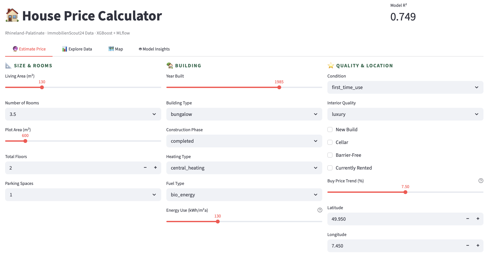

# 🏠 Immobilien Preisrechner · Rheinland-Pfalz

A machine learning app that estimates residential property purchase prices in **Rhineland-Palatinate, Germany**, using real ImmobilienScout24 listing data.

**Live demo:** *(deployed to [Streamlit Cloud](https://immo-preisrechner-rlpde.streamlit.app/))*

---

## Features

- **🔮 Preis schätzen** — input German property details (m², Zimmer, Zustand, Heizungsart…), get an instant price estimate in EUR with a ±12% confidence range and SHAP-powered explanation
- **📊 Daten erkunden** — interactive EDA: price distributions, condition/quality breakdowns, correlation matrix
- **🗺️ Karte** — geographic price heatmap of Rhineland-Palatinate with hover tooltips
- **🤖 Modell-Insights** — R², RMSE, MAE, MAPE metrics + feature importance + actual vs. predicted

---

## Stack

| Layer | Technology |
|---|---|
| Model | XGBoost (log-transformed target) |
| Preprocessing | sklearn ColumnTransformer (StandardScaler + OrdinalEncoder + OneHotEncoder) |
| Experiment tracking | MLflow |
| Database | SQLite |
| Frontend | Streamlit |
| Visualisation | Plotly, pydeck |
| Explainability | SHAP |

---



---

## Quickstart

```bash
# 1. Clone and install
git clone https://github.com/kachiann/immo-preisrechner-rlp
cd immo-preisrechner-rlp
pip install -r requirements.txt

# 2. Download the dataset from Kaggle (see below), place at data/immo_data.csv

# 3. Load into SQLite (filters to Rhineland-Palatinate automatically)
python setup_db.py

# 4. Train the model
python train.py

# 5. Launch the app
streamlit run app.py

# Optional: view MLflow experiments
mlflow ui
```

---

## Dataset

**Germany Housing – Rent and Price (ImmobilienScout24)**
[Kaggle →](https://www.kaggle.com/datasets/phanindraparashar/germany-housing-rent-and-price-data-set-apr-20)

Download `immo_data.csv` and place it at `data/immo_data.csv`.

`setup_db.py` automatically:
- Filters to `regio1 == "Rheinland-Pfalz"`
- If fewer than 500 RP listings are found, adds neighbouring states (Saarland, Hessen, NRW, BW) to ensure a robust model
- Keeps only for-sale listings with a valid purchase price

**Key features used:** `livingSpace` (m²), `noRooms`, `yearConstructed`, `condition`, `interiorQual`, `heatingType`, `typeOfFlat`, `balcony`, `hasKitchen`, `cellar`, `thermalChar`, `geo_lat/lng`

---

## Model Performance (approximate)

| Metric | Value |
|---|---|
| R² | 0.7491 |
| RMSE | ~€130000 |
| MAE | ~€78,000 |

---

## Project Structure

```
immo-preisrechner-rlp/
├── app.py           # Streamlit app (4 tabs, German UI)
├── train.py         # XGBoost pipeline + MLflow tracking
├── setup_db.py      # Load CSV → SQLite, filter for RLP
├── requirements.txt
├── .gitignore
├── data/
│   └── immo_data.csv       (gitignored — download from Kaggle)
└── models/
    ├── model.joblib         (gitignored)
    ├── preprocessor.joblib  (gitignored)
    └── metrics.json         (gitignored)
```

---

## Autorin

**Onyekachi Emenike** · [LinkedIn](https://www.linkedin.com/in/onyekachi-osisiogu/) · [Medium](https://medium.com/@kachiann) · Mainz, Rheinland-Pfalz
